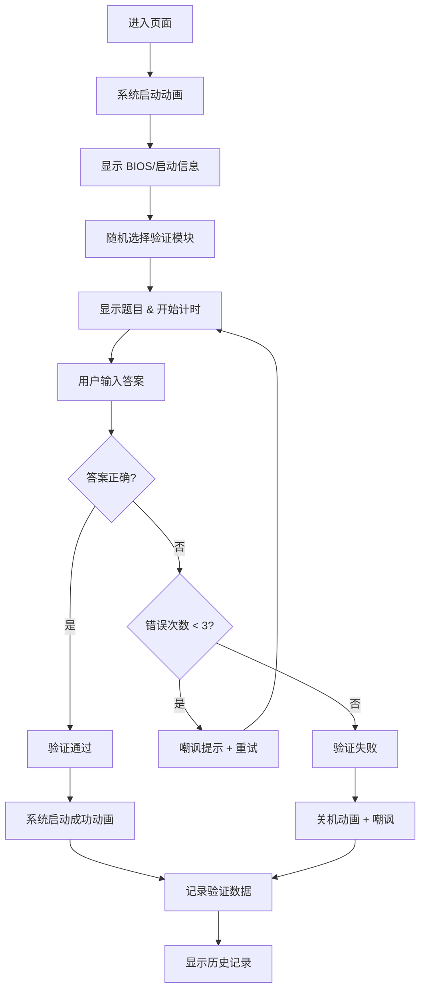

## 1. 产品概述

Web 版"系统开机验证模拟器"，灵感来源于程序员自制的 C 语言开机验证程序。用户需通过多种趣味验证挑战才能"开机"，失败则触发嘲讽式关机动画。

- **核心目的**：提供趣味性的复古 DOS 风格验证体验，模拟"开机验证"场景
- **目标用户**：喜欢极客文化、复古技术、趣味挑战的用户
- **产品价值**：娱乐性互动体验，展示技术与创意的结合

## 2. 核心功能

### 2.1 用户角色
| 角色 | 注册方式 | 核心权限 |
|------|---------|---------|
| 访客用户 | 无需注册 | 体验所有验证模块，查看历史记录 |

### 2.2 功能模块
1. **开机验证主界面**：复古 DOS 黑框终端，显示系统启动信息
2. **数学挑战模块**：限时数学运算题（加减乘除混合）
3. **Rot13 解密模块**：解密 Rot13 编码的字符串
4. **动态字符矩阵识别**：从动态字符矩阵中找出指定字符序列
5. **验证结果反馈**：通过显示"系统启动成功"，失败显示嘲讽式关机动画
6. **验证记录统计**：记录每次验证的用时、错误次数、模块类型

### 2.3 页面详情
| 页面名称 | 模块名称 | 功能描述 |
|---------|---------|----------|
| 主界面 | DOS 终端界面 | 复古黑框终端效果，打字机文字输出，光标闪烁 |
| 主界面 | 模块选择 | 随机或手动选择验证模块 |
| 主界面 | 验证交互区 | 显示题目、输入答案、倒计时提示 |
| 主界面 | 结果动画 | 通过/失败的动画效果展示 |
| 主界面 | 历史记录 | 显示最近验证记录（用时、错误次数） |

## 3. 核心流程

用户进入页面后，首先看到模拟的系统启动过程（BIOS信息、硬盘检测等），随后随机进入一个验证模块。用户有3次尝试机会，全部失败则触发"关机"嘲讽动画，成功则显示"系统启动成功"。所有验证结果都会被记录。

## 4. 用户界面设计

### 4.1 设计风格
- **主色调**：纯黑背景 (#000000) + 经典绿色文字 (#00FF00)，辅以琥珀色 (#FFB000) 作为强调色
- **按钮风格**：无按钮，纯终端命令行风格，输入框模拟 DOS 输入
- **字体**：使用等宽像素字体（如 VT323、Press Start 2P 或 Courier New）
- **布局风格**：全屏黑框终端，带扫描线效果和 CRT 屏幕弯曲感
- **视觉效果**：文字打字机效果、光标闪烁、屏幕闪烁、扫描线、噪点颗粒

### 4.2 页面设计概述
| 页面名称 | 模块名称 | UI 元素 |
|---------|---------|---------|
| 主界面 | DOS 终端 | 黑色背景、绿色文字、扫描线、CRT 效果、等宽字体、闪烁光标 |
| 主界面 | 启动信息区 | 逐行显示的 BIOS/系统信息，打字机效果 |
| 主界面 | 验证交互区 | 题目显示、输入提示符、倒计时进度条（字符画风格） |
| 主界面 | 结果展示 | 大字符 ASCII Art 展示成功/失败 |
| 主界面 | 历史记录 | 表格形式展示最近记录 |

### 4.3 响应性
- 桌面端优先，终端窗口居中显示固定宽度（800x600）
- 移动端自适应，终端窗口占满屏幕宽度
- 触控优化：输入框自动聚焦，虚拟键盘适配

### 4.4 动画效果
- **启动动画**：文字逐行输出，模拟系统自检
- **打字机效果**：所有文字逐字显示
- **光标闪烁**：经典下划线光标 500ms 闪烁
- **屏幕闪烁**：验证失败时屏幕闪红
- **关机动画**：屏幕逐渐变暗，最后收缩成一条线消失
- **成功动画**：屏幕变亮，显示 ASCII Art 启动成功画面
- **扫描线**：持续滚动的扫描线效果，模拟 CRT 显示器
