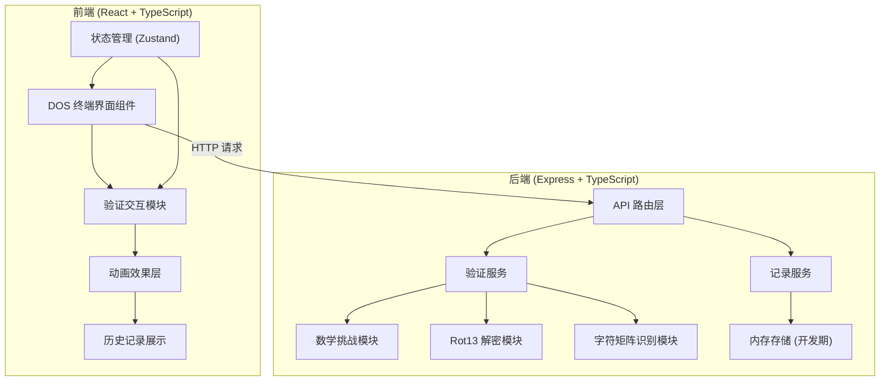
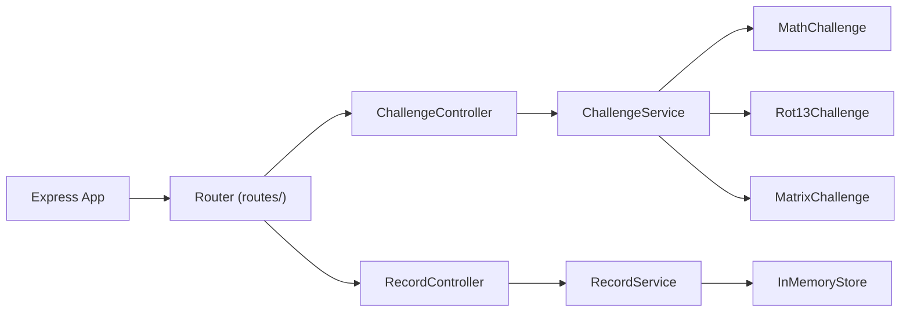
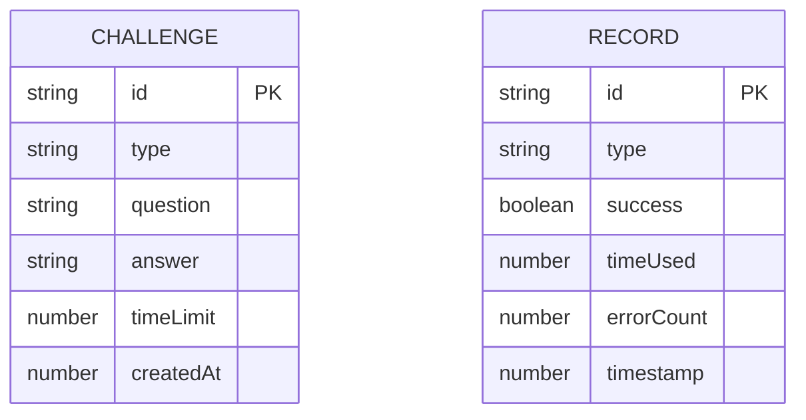

## 1. 架构设计



## 2. 技术描述

- **前端**: React@18 + TypeScript + Vite + TailwindCSS@3 + Zustand
- **初始化工具**: vite-init (react-express-ts 模板)
- **后端**: Express@4 + TypeScript
- **数据存储**: 内存存储（开发演示用），生产环境可替换为 SQLite/Redis
- **字体**: Google Fonts - VT323 (等宽像素字体)

## 3. 路由定义

| 路由 | 用途 |
|------|------|
| / | 主页面 - DOS 终端模拟器 |

## 4. API 定义

### 4.1 获取验证题目

**GET** `/api/challenge`

查询参数:
- `type` (可选): `math` | `rot13` | `matrix`，不传则随机

响应:
```typescript
interface ChallengeResponse {
  id: string;
  type: 'math' | 'rot13' | 'matrix';
  question: string;
  hint?: string;
  timeLimit: number; // 秒
}
```

### 4.2 提交答案

**POST** `/api/challenge/verify`

请求体:
```typescript
interface VerifyRequest {
  id: string;
  answer: string;
}
```

响应:
```typescript
interface VerifyResponse {
  correct: boolean;
  message: string;
  correctAnswer?: string;
}
```

### 4.3 记录验证结果

**POST** `/api/records`

请求体:
```typescript
interface RecordRequest {
  type: 'math' | 'rot13' | 'matrix';
  success: boolean;
  timeUsed: number; // 毫秒
  errorCount: number;
}
```

响应:
```typescript
interface RecordResponse {
  id: string;
  timestamp: number;
  type: string;
  success: boolean;
  timeUsed: number;
  errorCount: number;
}
```

### 4.4 获取历史记录

**GET** `/api/records`

响应:
```typescript
interface RecordsResponse {
  total: number;
  successCount: number;
  records: Array<{
    id: string;
    timestamp: number;
    type: string;
    success: boolean;
    timeUsed: number;
    errorCount: number;
  }>;
}
```

## 5. 服务器架构图



## 6. 数据模型

### 6.1 数据模型定义



### 6.2 内存存储结构

```typescript
// 验证挑战缓存
interface ChallengeStore {
  [id: string]: {
    id: string;
    type: 'math' | 'rot13' | 'matrix';
    question: string;
    answer: string;
    timeLimit: number;
    createdAt: number;
  };
}

// 验证记录
interface Record {
  id: string;
  type: 'math' | 'rot13' | 'matrix';
  success: boolean;
  timeUsed: number;
  errorCount: number;
  timestamp: number;
}
```
